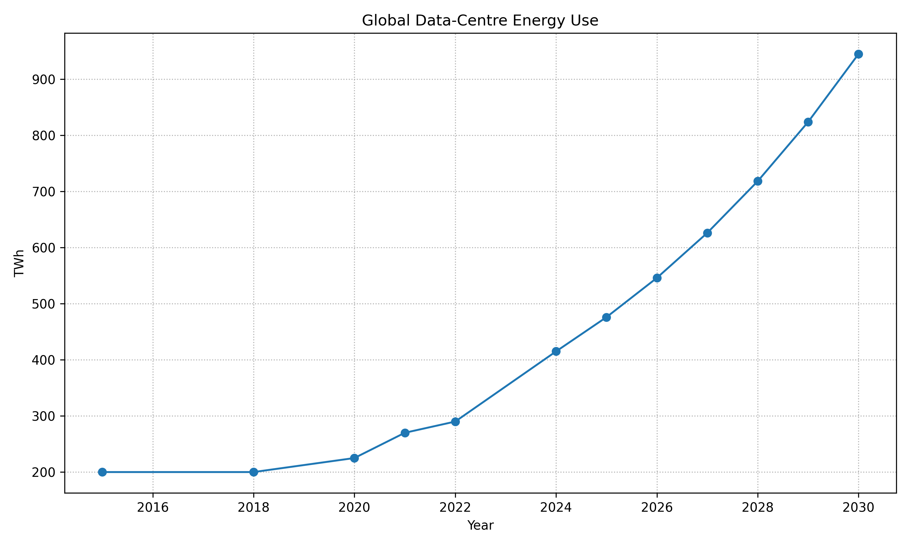
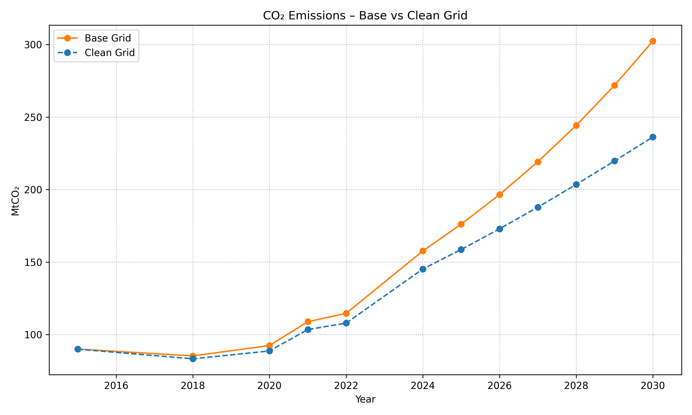
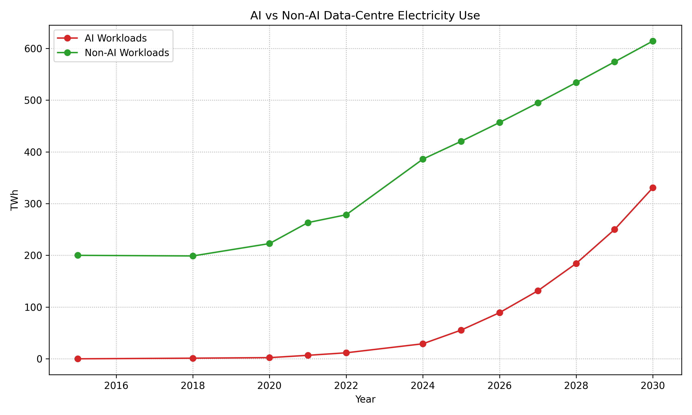
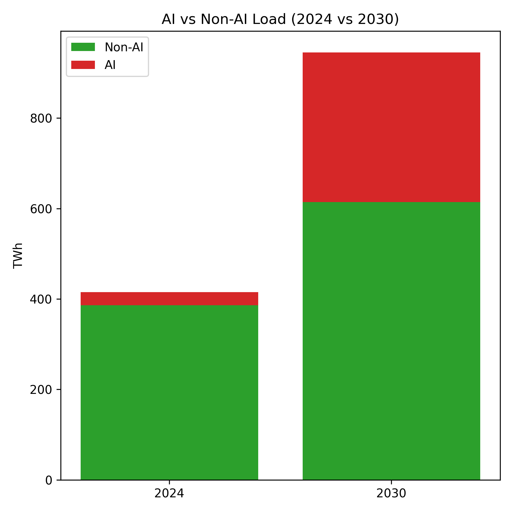

# Data-Center Energy Use in the AI Era

This repository contains a small, self-contained Python model of **global data-center electricity use** and **CO₂ emissions** before and after the rapid growth of AI workloads.

The goal is not to be a perfect forecast, but to provide a **clear visual story** for talks, reports, or class projects.

---

## 1. Data and Assumptions

- Historical totals (2015–2024) use approximate midpoints from the International Energy Agency (IEA) report *Data Centres and Data Transmission Networks* for global data-centre electricity (TWh/year), plus an estimate of ~415 TWh in 2024.
- 2030 projection follows the IEA base-case estimate of roughly **945 TWh/year**, i.e., about a doubling from 2024, largely driven by AI.
- Carbon intensity (gCO₂/kWh) is modeled with two simple trajectories:
  - A **base-case grid** (slower decarbonization).
  - A **cleaner grid** (faster decarbonization).
- AI share of total data-centre load is illustrative:
  - 0% in 2015 (pre-scale AI).
  - ~1% in 2020.
  - ~7% in 2024 (≈30 TWh of ≈415 TWh).
  - ~35% in 2030 (aggressive AI growth scenario).

You can adjust all of these inputs in `data_center_ai_energy.py`.

---

## 2. How to Run

```bash
pip install -r requirements.txt
python data_center_ai_energy.py
```

This will generate four figures in the `figures/` folder:

- `energy_total.png` – total global data-centre electricity use (historical + projection).
- `emissions_scenarios.png` – CO₂ emissions under base vs clean grid.
- `ai_vs_non_ai_timeseries.png` – AI vs non-AI electricity use (time series).
- `ai_vs_non_ai_2024_2030.png` – stacked bars for AI vs non-AI in 2024 vs 2030.

---

## 3. Figures (Preview)

### Global Data-Centre Electricity Use – Historical + Projection



*Very short explanation:* Total data-centre electricity is mostly flat until the late 2010s, then rises and is projected to almost double by 2030, largely due to AI and cloud growth.

---

### CO₂ Emissions from Global Data Centres – Base vs Clean Grid



*Very short explanation:* Emissions increase with electricity demand, but a cleaner grid significantly reduces CO₂ for the same amount of compute.

---

### AI vs Non-AI Data-Centre Electricity Use (Time Series)



*Very short explanation:* Non-AI workloads dominate today, but AI grows much faster and becomes a large fraction of total data-centre energy use by 2030.

---

### AI vs Non-AI Load in 2024 vs 2030 (Stacked Bars)



*Very short explanation:* In 2024 AI is a small slice of total load; by 2030 it becomes a major share, even as non-AI demand also increases.

---

## 4. References (Selected)

- International Energy Agency (IEA). *Data Centres and Data Transmission Networks*  
  <https://www.iea.org/reports/data-centres-and-data-transmission-networks>

- IEA. *Energy and AI – Energy Demand from AI*  
  <https://www.iea.org/reports/energy-and-ai>

- UN/ITU and major cloud-provider sustainability reports (Google, AWS, Microsoft, Meta) for additional context on data-centre energy, efficiency, and emissions.

This repo is a simplified educational model and should not be treated as an official forecast.
